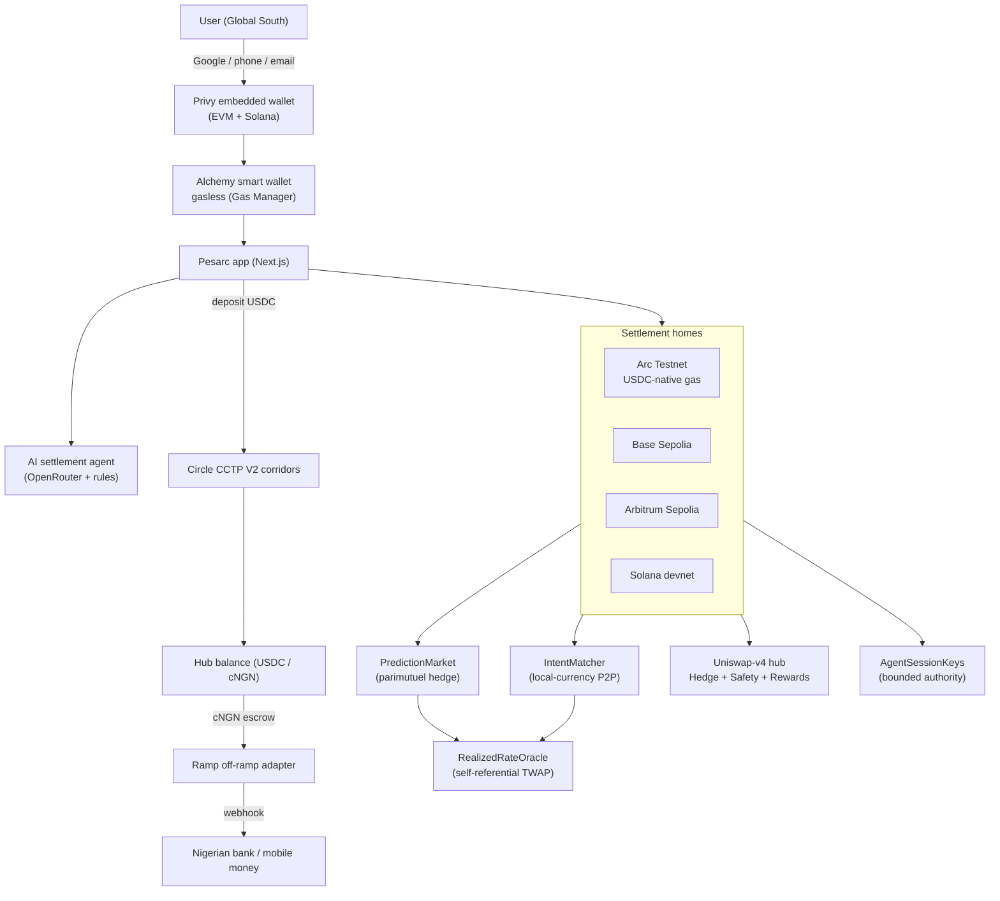

# Pesarc — Circle / Arc microgrant submission

> **Pesarc** is a stablecoin-native settlement network + AI agent for the Global
> South. Send, hold, **earn**, **invest**, **hedge**, and **settle** money across
> borders in local-currency stablecoins — **no dollar in the path, gasless** —
> with a real fiat off-ramp to banks and mobile money.

## Why this belongs on Circle / Arc

Arc is a stablecoin-native L1 where **USDC is the gas token**. That is exactly
Pesarc's thesis made native: users never touch a volatile gas token, and value
moves and settles in stablecoins end to end.

- **USDC-native settlement + gas.** On Arc, the "no gas token, settle in
  stablecoins" experience is the chain's default, not something we bolt on.
- **CCTP V2 already wired.** The Add-money flow deposits native USDC from a spoke
  chain over **Circle CCTP V2** and credits it on the hub (as tUSD, or
  auto-converted to a local stable like cNGN).
- **Programmable money / digital finance.** Payments, a parimutuel
  prediction/hedge market, local-currency P2P settlement, tokenized-equity
  investing, DeFi lending, and an insured earn vault — all stablecoin-settled.

## What's built and working

| Layer | What | Status |
|---|---|---|
| App (Next.js) | Send/receive, Invest, Earn, Markets, Business, Agent, Add-money (CCTP), Pay, Receive, fiat payouts | Live on testnet |
| Auth / wallets | Privy embedded wallets (Google / phone / email / passkey) + Alchemy smart-wallet gasless | Live |
| Contracts (Solidity/Foundry) | `PredictionMarket` (parimutuel), `IntentMatcher` (local-currency P2P settlement), `RealizedRateOracle` (self-referential price), `AgentSessionKeys` (bounded agent authority), Uniswap-v4 liquidity hub (`GoldgardHook`, `HedgeReserve`, `SafetyModule`, `RewardDistributor`, `OracleAdapter`) | 41 tests passing |
| Solana (Anchor) | `prediction-market`, `realized-rate-oracle`, `spoke-gateway` | Deployed to devnet |
| AI agent | Plain-language → on-chain settlement, market creation, and info — OpenRouter LLM with a rule-based fallback | Live (demo mode without keys) |
| Fiat off-ramp | KYC → bank / mobile-money payout; USDC escrow on-chain; webhook-driven partner adapter | Sandbox + provider seam |

## Deployed (testnet)

| Chain | Prediction market | Notes |
|---|---|---|
| **Arc Testnet** (chain `5042002`) | `0xe9f109b826de37A6481eAfC60985B5b36763558B` | Live; USDC is the gas token. Testnet does **not** qualify for the grant |
| **Arc mainnet** (chain `5042`) | _pending — required for the grant_ | Fund the deployer with USDC on Arc mainnet, then run `DeployArc.s.sol` |
| Base Sepolia | `0xD6f0f1C8DC2AeD9Fc2886fed19eAfC34f699062E` | |
| Arbitrum Sepolia | `0x088c60c5C1AC2f519497B36CFA72326e2c4b9904` | |
| Solana devnet | `2aMC2CKjqwxmLrS6dv98c6pVYEKogRXxEuz3NZpzv8CZ` | |

Arc testnet stack: IntentMatcher `0x5f7Cb34cA29d0554998882B716DC86e0B764f206`,
RealizedRateOracle `0x48484e904EA964a649D0c73666bA1E91d3Ca2349`, cNGN
`0xE76E4f347667d973a1B968733bE41738f2AE202C`. USDC (native gas token) is the
predeploy `0x3600…0000`.

The contracts are chain-agnostic Solidity (Uniswap-style) — deploying to Arc is
a config + deploy step, and the app already switches chains in-session.

## Architecture

## Circle tech mapping

- **USDC** — settlement asset and (on Arc) gas token.
- **CCTP V2** — cross-chain USDC deposit corridors (`Add money`).
- **Circle Wallets / Gas Station** — natural next integration for sponsored Arc gas.

## Demo script (≈3 min)

1. **Sign in** with Privy (Google) → an embedded wallet is created on Arc.
2. **Get test funds** (in-app faucet) → local-currency stables + gas.
3. **Send** ₦50,000 to a contact → the agent asks *which chain or bank* → settles
   peer-to-peer, no dollar in the path.
4. **Hedge** 50,000 naira on a parimutuel prediction market.
5. **Earn** on a corridor and **invest** in a Global-South stock (settled in cNGN).
6. **Withdraw** to a Nigerian bank via the fiat off-ramp.

## Links

- Contracts (public): https://github.com/pesarc/contracts
- App: https://github.com/pesarc/app
- Demo URL (Vercel preview): https://pesarc-dbmv81wzr-jorshimayors-projects.vercel.app
  (turn off Vercel Deployment Protection to make it public)

> **Microgrant eligibility:** this program requires a live **Arc _mainnet_**
> deployment. The Arc row above is testnet (chain `5042002`) and does not
> qualify on its own — deploy PredictionMarket + IntentMatcher to Arc mainnet
> (fund operator `0xd4418f403F86De7DB7D1885d83A6d9A5bBf701F1` with USDC on Arc
> mainnet for gas) and record the address + tx here before submitting. See
> `docs/HACKATHON_APPLICATIONS.md`.

---

_This document is the submission scaffold. Fill in the Arc deployment addresses,
the demo video link, and the hosted URL before submitting._
