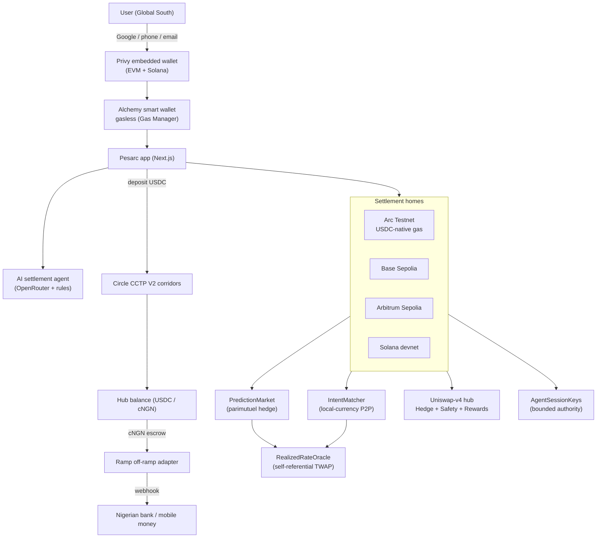

# Pesarc — Circle / Arc microgrant submission

> **Pesarc** is a stablecoin-native settlement network + AI agent for the Global
> South. Send, hold, **earn**, **invest**, **hedge**, and **settle** money across
> borders in local-currency stablecoins — **no dollar in the path, gasless** —
> with a real fiat off-ramp to banks and mobile money.

## Why this belongs on Circle / Arc

Arc is a stablecoin-native L1 where **USDC is the gas token**. That is exactly
Pesarc's thesis made native: users never touch a volatile gas token, and value
moves and settles in stablecoins end to end.

- **USDC-native settlement + gas.** On Arc, the "no gas token, settle in
  stablecoins" experience is the chain's default, not something we bolt on.
- **CCTP V2 already wired.** The Add-money flow deposits native USDC from a spoke
  chain over **Circle CCTP V2** and credits it on the hub (as tUSD, or
  auto-converted to a local stable like cNGN).
- **Programmable money / digital finance.** Payments, a parimutuel
  prediction/hedge market, local-currency P2P settlement, tokenized-equity
  investing, DeFi lending, and an insured earn vault — all stablecoin-settled.

## What's built and working

| Layer | What | Status |
|---|---|---|
| App (Next.js) | Send/receive, Invest, Earn, Markets, Business, Agent, Add-money (CCTP), Pay, Receive, fiat payouts | Live on testnet |
| Auth / wallets | Privy embedded wallets (Google / phone / email / passkey) + Alchemy smart-wallet gasless | Live |
| Contracts (Solidity/Foundry) | `PredictionMarket` (parimutuel), `IntentMatcher` (local-currency P2P settlement), `RealizedRateOracle` (self-referential price), `AgentSessionKeys` (bounded agent authority), Uniswap-v4 liquidity hub (`GoldgardHook`, `HedgeReserve`, `SafetyModule`, `RewardDistributor`, `OracleAdapter`) | 41 tests passing |
| Solana (Anchor) | `prediction-market`, `realized-rate-oracle`, `spoke-gateway` | Deployed to devnet |
| AI agent | Plain-language → on-chain settlement, market creation, and info — OpenRouter LLM with a rule-based fallback | Live (demo mode without keys) |
| Fiat off-ramp | KYC → bank / mobile-money payout; USDC escrow on-chain; webhook-driven partner adapter | Sandbox + provider seam |

## Deployed (testnet)

| Chain | Prediction market | Notes |
|---|---|---|
| **Arc Testnet** (chain `5042002`) | `0xe9f109b826de37A6481eAfC60985B5b36763558B` | Live; USDC is the gas token. Testnet does **not** qualify for the grant |
| **Arc mainnet** (chain `5042`) | `0xe9f109b826de37A6481eAfC60985B5b36763558B` | **LIVE** (deployed 2026-09-27). USDC is the gas token. Grant-eligible |
| Base Sepolia | `0xD6f0f1C8DC2AeD9Fc2886fed19eAfC34f699062E` | |
| Arbitrum Sepolia | `0x088c60c5C1AC2f519497B36CFA72326e2c4b9904` | |
| Solana devnet | `2aMC2CKjqwxmLrS6dv98c6pVYEKogRXxEuz3NZpzv8CZ` | |

### Arc mainnet stack (chain `5042`, live 2026-09-27)

| Contract | Address | Deploy tx |
|---|---|---|
| PredictionMarket | `0xe9f109b826de37A6481eAfC60985B5b36763558B` | `0x5243246633863eda7b96811f81bc0ae607e4f0dea21f817267fa5e3e7c2a58ed` |
| IntentMatcher | `0x5f7Cb34cA29d0554998882B716DC86e0B764f206` | `0x0bcd178bc85528aeb64c083f8dd348ca9b0542e8f0d6ddaee5f048c0bfeb6b47` |
| RealizedRateOracle | `0x48484e904EA964a649D0c73666bA1E91d3Ca2349` | `0x83b403ecc282ab60b99d14e673e69ffb14ba7c26af06adb0445efb09f256381b` |
| cNGN (test stable) | `0xE76E4f347667d973a1B968733bE41738f2AE202C` | `0x58ea8d6c52c40849b89669e32e9ee222af56033af4bcf0f52d1fb40a767efdcc` |
| cGHS (test stable) | `0xb3387B3cCAd4ef68e0c348735daA1C306D17C004` | `0x78e8e7fbb645b5ea1b8e37fed4b39369d164d19c456c0e9fc86829fd01762c05` |
| cKES (test stable) | `0x6616D69AcbB9fe9Ef630171C069CC069a0d8464f` | `0x523f1b4e40b34bac6b734902b9e6cbbae24a0bf797f93fe6e1a93e03eaf2431b` |
| USDC (native gas token) | `0x3600000000000000000000000000000000000000` | predeploy |

Deployer / treasury: `0xd4418f403F86De7DB7D1885d83A6d9A5bBf701F1`. Two markets
seeded at deploy: `#1` USD/NGN ≥ 1600 (oracle-resolved), `#2` Nigeria CPI < 30%
(attested). ~6.43M gas total across 14 txs. The same bytecode is live on Arc
testnet (chain `5042002`) at the identical addresses (deterministic).

### Seeded event markets (Polymarket-for-Africa, live on Arc mainnet)

Beyond the 2 deploy-time markets, 8 curated Yes/No markets were seeded on the
same PredictionMarket (`SeedArcMarkets.s.sol`, ~0.044 USDC, market count 2 → 10),
spanning the four themes the product now leads with: African elections/politics,
sports (AFCON/football), macro & prices, and global events for African punters.
All are Attested (owner-curated, on-chain dispute window), staked and settled in
cNGN:

1. CBN cuts the benchmark rate (MPR) before 31 Dec 2026 — `0xc28331cd…fae9f31f`
2. Incumbent ruling party wins Nigeria's 2027 presidential election — `0x7f6ff3c1…af3501ae4`
3. Super Eagles qualify for the 2026 FIFA World Cup — `0x1e78bb17…5965f112`
4. African player is 2026/27 Premier League top scorer — `0x9feb2fcb…8702bd27`
5. USD/NGN closes above 1600 at year-end 2026 — `0x63033ff1…708ed662`
6. Petrol (PMS) exceeds ₦1000/litre nationwide before 30 Jun 2027 — `0xc1cabcb5…2ef86bfd`
7. Bitcoin above $150,000 before 31 Dec 2026 — `0x460e4879…943174d46`
8. Ethereum above $6,000 before 30 Jun 2027 — `0x1e17107d…428bdfaa`

The contracts are chain-agnostic Solidity (Uniswap-style) — deploying to Arc was
a config + deploy step, and the app already switches chains in-session.

## Arc mainnet deployment — DONE ✅

The hub is **live on Arc mainnet** (chain `5042`) as of 2026-09-27:

1. ✅ **Deployer funded** — operator `0xd4418f403F86De7DB7D1885d83A6d9A5bBf701F1`
   funded with USDC (Arc's gas token); ~0.34 USDC spent on the deploy.
2. ✅ **Deployed** via `forge script script/DeployArc.s.sol --rpc-url arc
   --broadcast --slow` — PredictionMarket + IntentMatcher + RealizedRateOracle +
   3 local-stable test tokens + 2 seed markets (addresses/txs above).
3. ✅ **App wired** — `NEXT_PUBLIC_HUB_CHAIN_ID=5042`,
   `NEXT_PUBLIC_ACTIVE_CHAIN=arc`, and the `NEXT_PUBLIC_ARC_*` address block set
   in the env. The app labels the chain "Arc", uses `https://rpc.mainnet.arc.io` +
   the Arc explorer, and reads the Arc prediction market / matcher / oracle
   (`chain/registry.ts`). CCTP add-money/bridge to Arc (domain 26) already wired.
4. ⏳ **Record + submit** — addresses + txs recorded above; still need the demo
   video + public hosted URL, then submit.

Note on gasless: gasless smart-wallet sends on Arc go through an ERC-7677
paymaster (Circle Gas Station or our in-house paymaster; Pimlico bundler +
paymaster verified end-to-end on Arc **testnet**). Arc **mainnet** gasless still
needs a funded Pimlico sponsorship policy / Circle Paymaster before it is enabled
for users — see `docs/GAS_SPONSORSHIP.md`.

## Architecture

```mermaid
flowchart TD
  U["User (Global South)"] -->|Google / phone / email| PV["Privy embedded wallet<br/>(EVM + Solana)"]
  PV --> SW["Alchemy smart wallet<br/>gasless (Gas Manager)"]
  SW --> APP["Pesarc app (Next.js)"]

  APP --> AG["AI settlement agent<br/>(OpenRouter + rules)"]

  APP -->|deposit USDC| CCTP["Circle CCTP V2 corridors"]
  CCTP --> HUB["Hub balance (USDC / cNGN)"]

  subgraph CHAINS["Settlement homes"]
    ARC["Arc Testnet<br/>USDC-native gas"]
    BASE["Base Sepolia"]
    ARB["Arbitrum Sepolia"]
    SOL["Solana devnet"]
  end

  APP --> CHAINS
  CHAINS --> PM["PredictionMarket<br/>(parimutuel hedge)"]
  CHAINS --> IM["IntentMatcher<br/>(local-currency P2P)"]
  CHAINS --> LP["Uniswap-v4 hub<br/>Hedge + Safety + Rewards"]
  CHAINS --> ASK["AgentSessionKeys<br/>(bounded authority)"]
  IM --> ORC["RealizedRateOracle<br/>(self-referential TWAP)"]
  PM --> ORC

  HUB -->|cNGN escrow| RAMP["Ramp off-ramp adapter"]
  RAMP -->|webhook| BANK["Nigerian bank / mobile money"]
```

## Circle tech mapping

- **USDC** — settlement asset and (on Arc) gas token.
- **CCTP V2** — cross-chain USDC deposit corridors (`Add money`).
- **Circle Wallets / Gas Station** — natural next integration for sponsored Arc gas.

## Demo script (≈3 min)

1. **Sign in** with Privy (Google) → an embedded wallet is created on Arc.
2. **Get test funds** (in-app faucet) → local-currency stables + gas.
3. **Send** ₦50,000 to a contact → the agent asks *which chain or bank* → settles
   peer-to-peer, no dollar in the path.
4. **Hedge** 50,000 naira on a parimutuel prediction market.
5. **Earn** on a corridor and **invest** in a Global-South stock (settled in cNGN).
6. **Withdraw** to a Nigerian bank via the fiat off-ramp.

## Links

- Contracts (public): https://github.com/pesarc/contracts
- App: https://github.com/pesarc/app
- Demo URL (Vercel preview): https://pesarc-7iqxnr0ly-jorshimayors-projects.vercel.app
  (turn off Vercel Deployment Protection to make it public)

> **Microgrant eligibility:** this program requires a live **Arc _mainnet_**
> deployment. ✅ **Met** — PredictionMarket + IntentMatcher + RealizedRateOracle
> are live on Arc mainnet (chain `5042`), addresses + txs above. Remaining before
> submission: demo video + public hosted URL. See
> `docs/HACKATHON_APPLICATIONS.md`.

---

_Arc mainnet addresses recorded. Still to add before submitting: the demo video
link and the public hosted URL._
